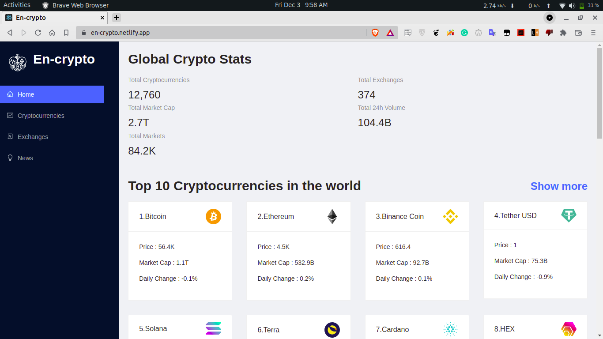
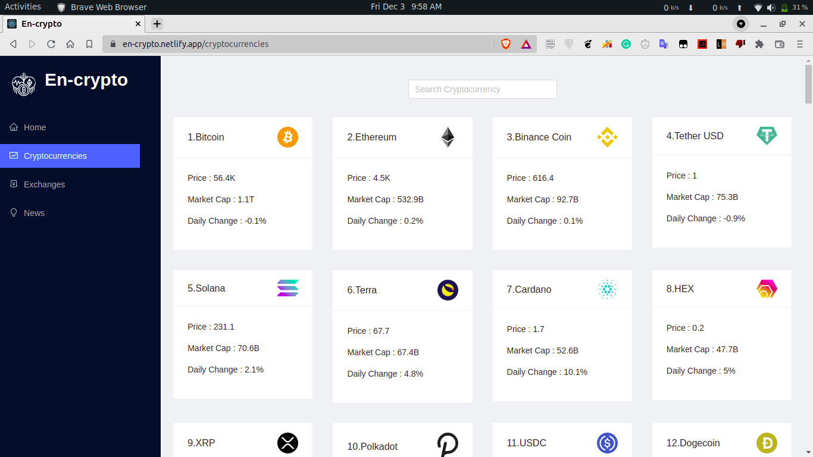
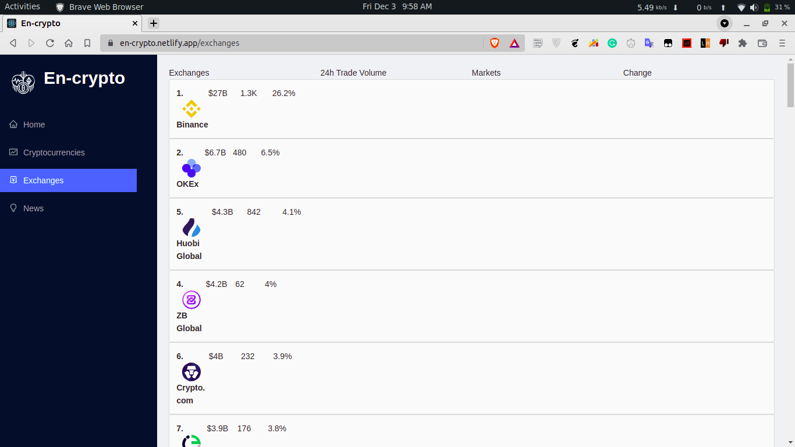
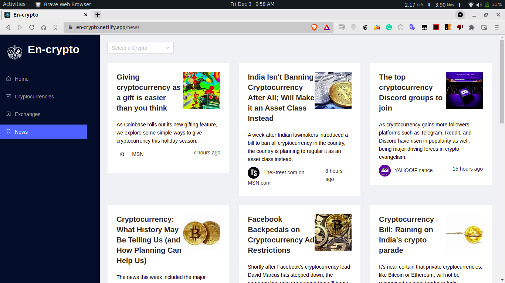
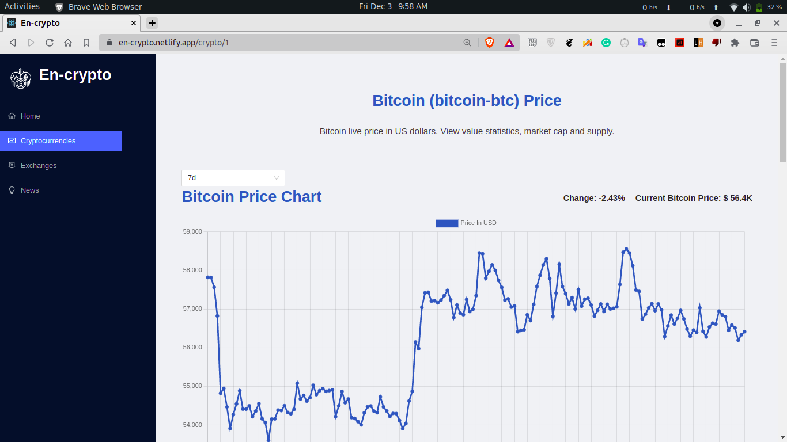
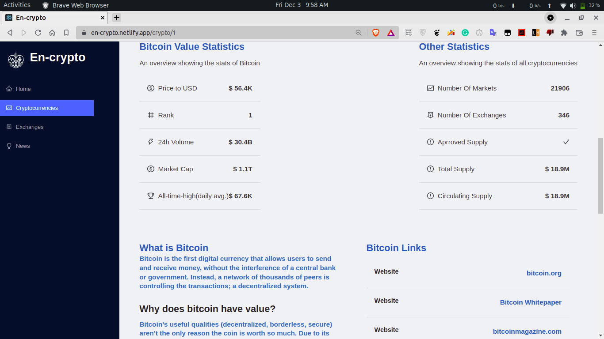

# En-crypto

---

> A Cryptocurrency app made using Ant Design, created charts using Chart.js, and fetched data from multiple sources using RapidAPI.

---

For live Demo you can click here -> [Live Demo](https://en-crypto.netlify.app/)

---

## Below are some glimpses of the webapp.

---

### Home Page

### Cryptocurrency

### Exchanges

### News

### Bitcoin

### Bitcoin Statistics

